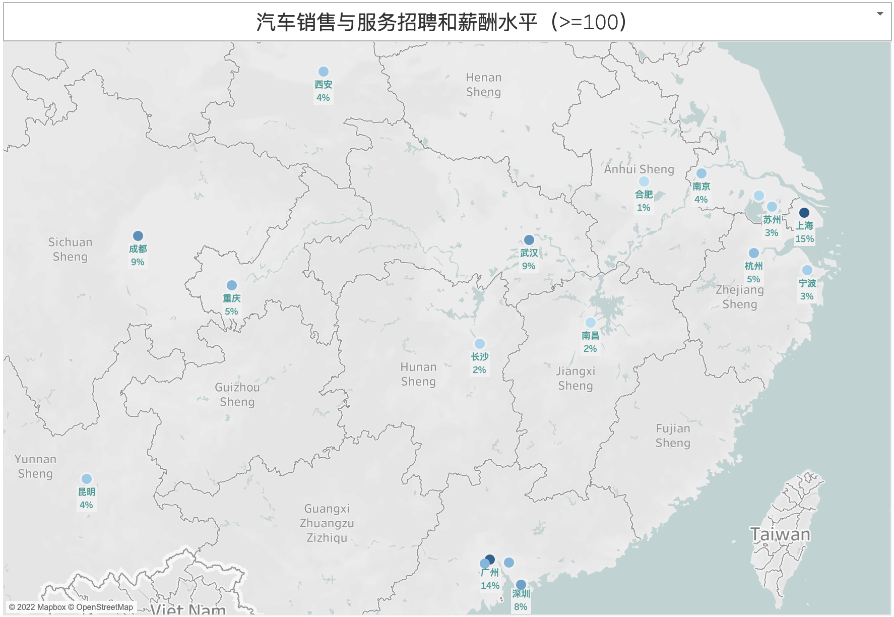
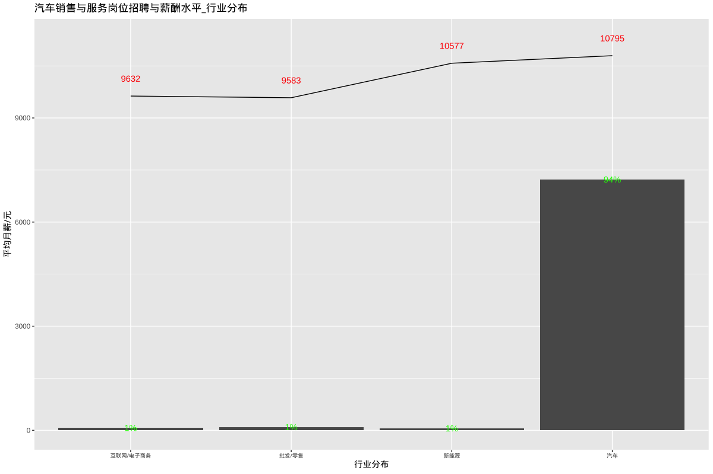
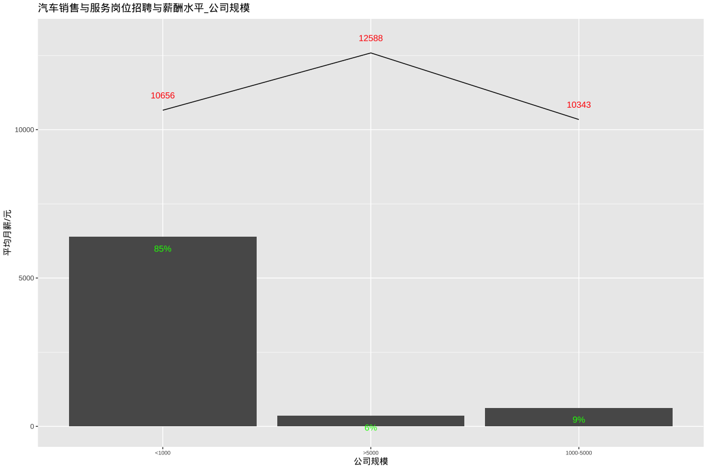
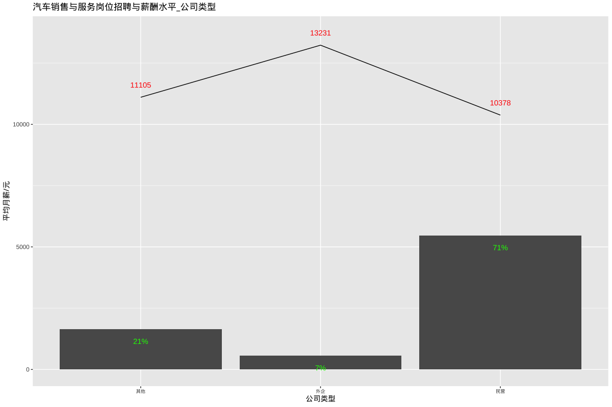
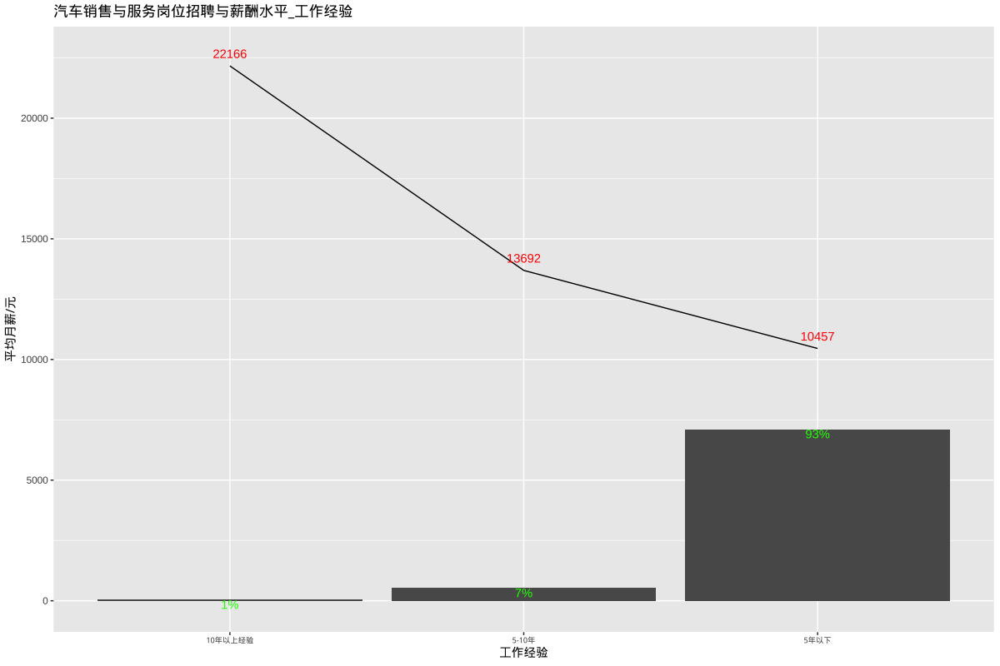
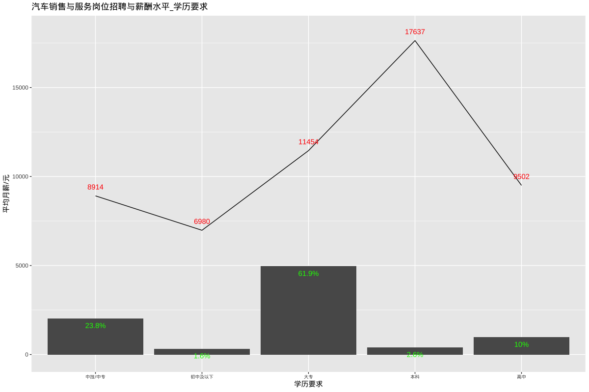

# 汽车销售与服务招聘和薪酬水平

## 总述

本次采集有效数据7679条（城市发布量\>=100），主要分析汽车销售与服务相关岗位招聘和薪酬，岗位如服务顾问、销售顾问、汽车维修工、洗车工、二手车评估、油漆工、客服、售后经理、机电技师、汽车美容等。我们将从如下方面分析：

-   01.城市分布：上海占15%，平均月薪11929元；广州占14%，平均月薪10278元；其余城市均在9%或以下。

-   02.行业分布：汽车占94%，平均月薪10795元。

-   03.公司规模：1000人以下占85%，平均月薪10656元；1000-5000人占9%，平均月薪10343元。

-   04.公司类型：民企占71%，平均月薪10378元；外企占7%，平均月薪13231元。

-   05.工作经验：5年以下占93%，平均月薪10457元；5-10年占7%，平均月薪13692元。

-   06.学历要求：大专占62%，平均月薪11454元；中技/中专占24%，平均月薪8914元。

## 01.城市分布

## 02.行业分布

## 03.公司规模

## 04.公司类型

## 05.工作经验

## 06.学历要求

